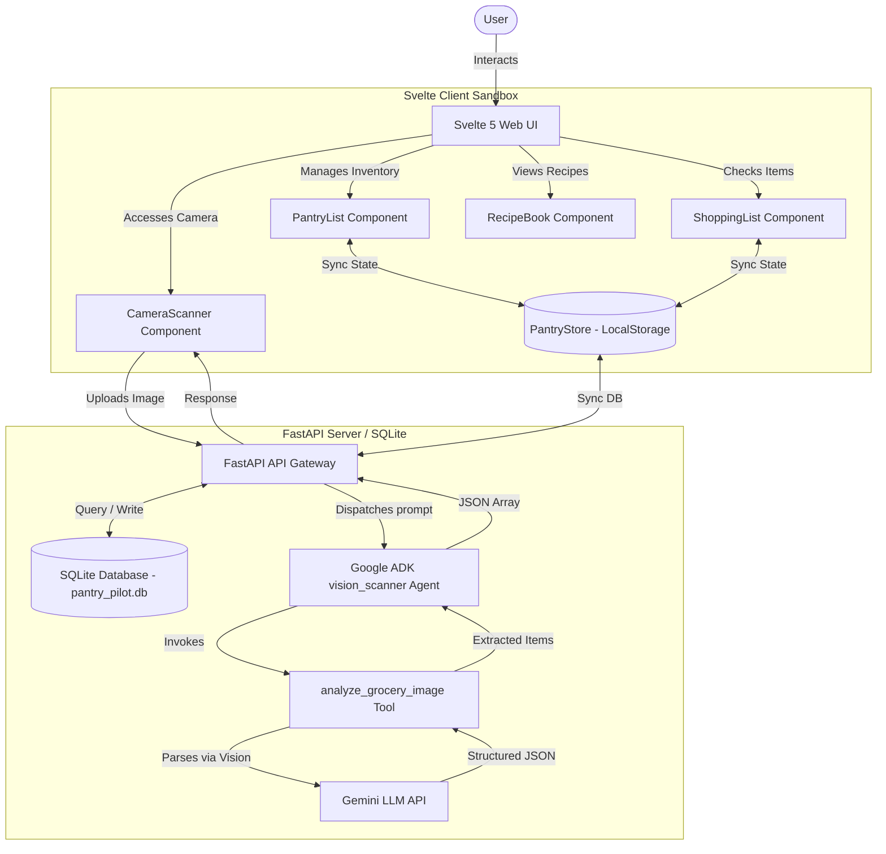

# Pantry Pilot 🍳✈️
### AI-Powered Smart Grocery Scanner & Recipe Cookbook

Pantry Pilot is an agentic, offline-first web application designed to help users track their kitchen inventory, automatically match available items with gourmet recipes, and manage a dynamic shopping checklist.

Built with **Vite + Svelte 5 (with Svelte Runes) + TypeScript + Vanilla CSS**, it features a modern dark-mode glassmorphic interface, smooth native micro-animations, and is powered by a **Google Agent Development Kit (ADK)** Python FastAPI backend.

---

## 📌 1. The Problem
Managing a home kitchen efficiently is challenging due to several common problems:
* **Food Waste**: Ingredients expire unnoticed in the back of the pantry.
* **Manual Inventory Friction**: Manually logging every grocery item, quantity, and category is tedious and prone to human error, causing users to abandon inventory tracking apps.
* **Recipe Disconnect**: Traditional cookbooks and recipe websites require users to manually check if they have each ingredient in stock, leading to last-minute grocery runs or cooking failures.
* **Disconnected Shopping Lists**: Compiling a list of missing items for a week's recipes is a manual, fragmented process.

---

## 💡 2. The Solution
Pantry Pilot solves these problems by creating a unified, visual, and agentic assistant:
* **AI-Assisted Logging**: Users simply point their camera or drag in a picture of their groceries. The **ADK Vision Agent** parses the photo, classifies the items, and extracts quantities and categories automatically, leaving only quick review/verification to the user.
* **Automated Recipe Matching**: The cookbook scans the local pantry and dynamically calculates the match percentage for each recipe, indicating if you are `Ready to Cook` or showing the exact number of missing items.
* **Automatic Inventory Deductions**: When a user cooks a recipe, the application automatically deducts the exact required quantities from the pantry.
* **Dynamic Shopping Sync**: Missing recipe ingredients are automatically calculated and sent directly to the shopping checklist. Checked-off items are moved back into the active pantry inventory in a single click.

---

## 🏗️ 3. System Architecture & Diagram

Pantry Pilot uses a decoupled architecture where the Svelte client handles reactive presentation and local persistence (optimistic UI), while the FastAPI backend provides services for the Google ADK agent and a persistent SQLite database.



---

## 🎨 4. Design Decisions & Aesthetics

To deliver a premium, modern experience, the application adheres to strict design and architectural decisions:
* **Frosted Glassmorphism**: Cards and controls utilize translucent dark backgrounds (`rgba(30, 41, 59, 0.45)`) combined with high blur backdrops (`backdrop-filter: blur(12px)`) and thin borders (`rgba(255, 255, 255, 0.07)`) to mimic premium frosted panels.
* **Runes-Based Reactivity**: Utilizing Svelte 5's `$state`, `$derived`, and `$derived.by` runes ensures the UI responds instantly to state changes in our global store class, avoiding unnecessary component re-renders.
* **Offline-First Resilience**: All inventory, cooking, and shopping states are stored locally in the browser's `localStorage`. Svelte auto-probes the backend and gracefully degrades to **Local Mock Mode** if the API server is offline.
* **Zero API Key Leakage**: No cloud secrets, API keys, or keys are hardcoded in the frontend, preventing security vulnerabilities and ensuring privacy.

---

## 📂 5. Codebase Directory Structure

```
pantry-pilot/
├── backend/                 # Google ADK Agent Python Backend
│   ├── requirements.txt     # Python backend dependencies
│   ├── agent.py             # ADK agent setup and vision tool
│   ├── main.py              # FastAPI endpoints exposing ADK agents
│   └── .env.example         # Template for environment configuration
├── src/
│   ├── assets/              # Static SVG logos
│   ├── components/
│   │   ├── CameraScanner.svelte  # Live webcam, visual overlays, and backend sync
│   │   ├── PantryList.svelte     # Inventory display and manual inputs
│   │   ├── RecipeBook.svelte     # Recipe search, modal, and match algorithm
│   │   └── ShoppingList.svelte   # Checklist and bulk purchase transition
│   ├── stores/
│   │   └── pantryStore.svelte.ts # Global reactive state & localStorage sync
│   ├── utils/
│   │   └── recipeData.ts         # Gourmet recipe database
│   ├── app.css              # Custom styling system and animations
│   ├── main.ts              # Svelte mount file
│   └── App.svelte           # Header, mobile bottom-bar, and tab shell
├── index.html               # Main entry HTML importing Outfit font
├── package.json             # Build commands and dependency catalog
├── tsconfig.json            # TypeScript compile configurations
└── svelte.config.js         # Svelte compiler configuration
```

---

## 🚀 6. Setup & Launch
Please refer to the separate [SETUP.md](file://wsl.localhost/Ubuntu-24.04/home/keyau/pantry-pilot/SETUP.md) file for detailed installation instructions and run commands.

---

## 🧪 7. Testing Guide
To learn more about automated and manual testing procedures, refer to the [TESTING.md](file://wsl.localhost/Ubuntu-24.04/home/keyau/pantry-pilot/TESTING.md) guide.

